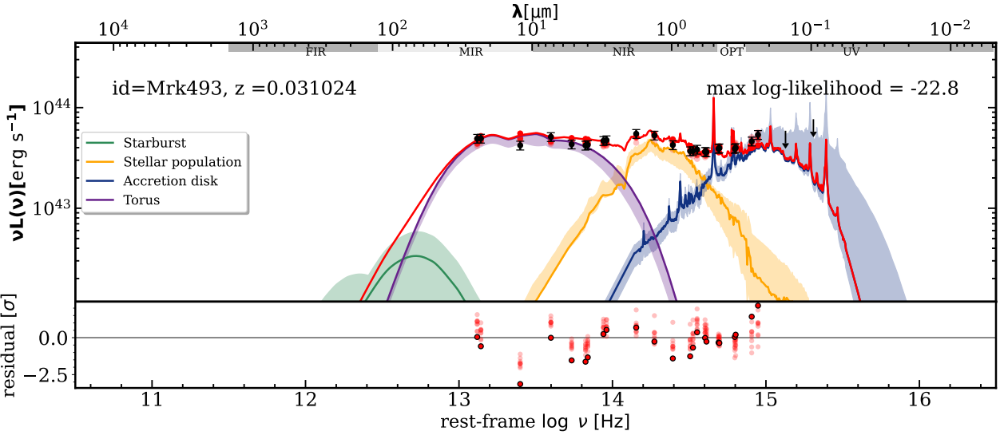
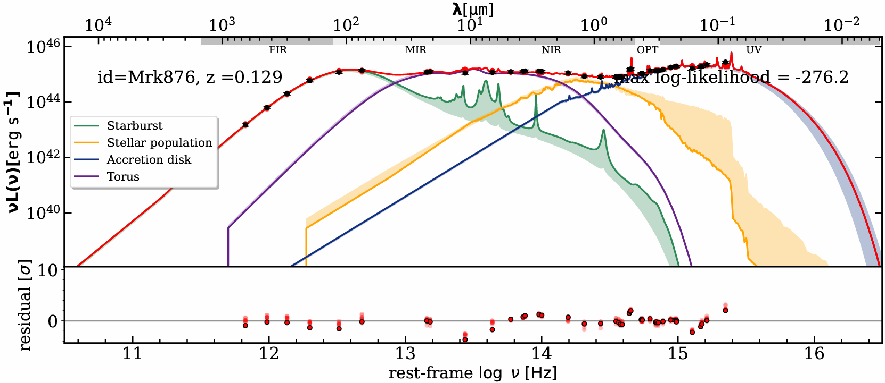
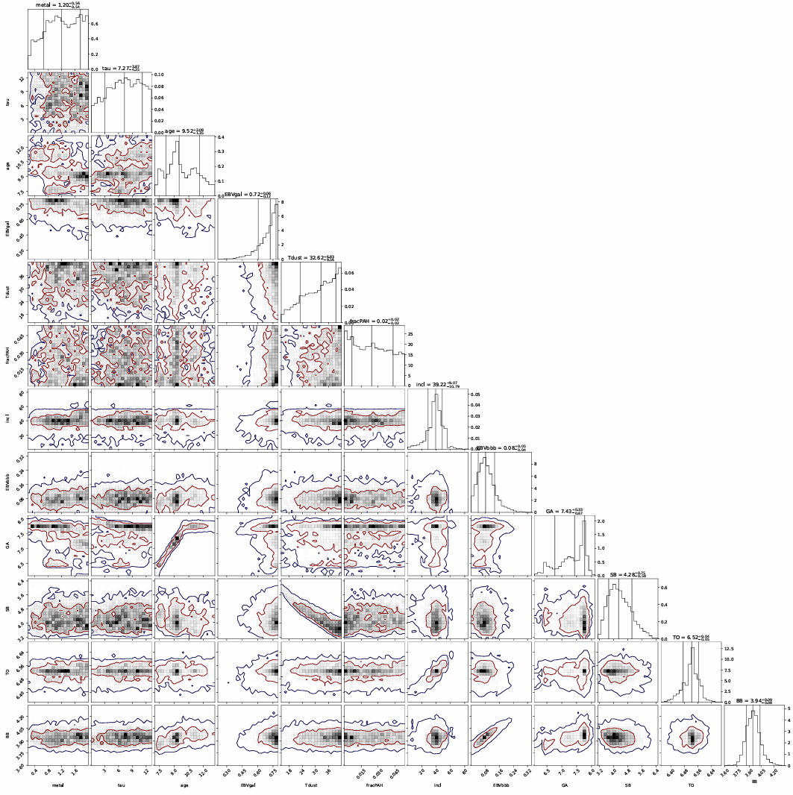
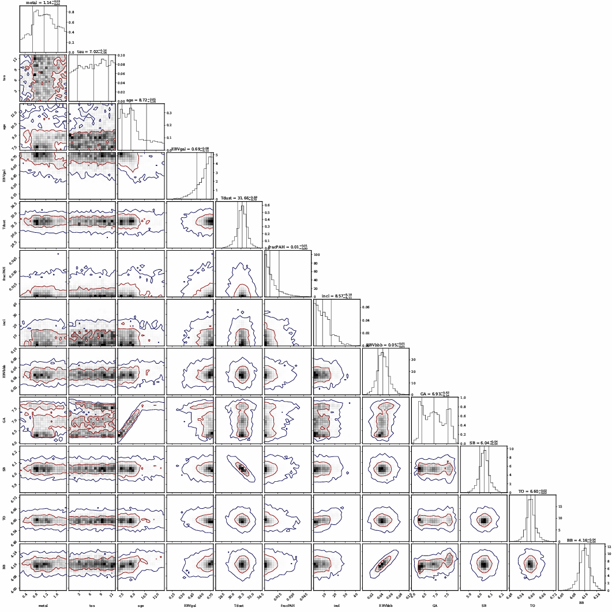

# AGN Spectral Energy Distribution Modeling using Bayesian MCMC

This project implements and evaluates a Bayesian SED-fitting approach for Active Galactic Nuclei (AGN), based on the AGNfitter framework, applied to real multi-wavelength observational data.

---

## 🚀 Project Overview

Active Galactic Nuclei (AGN) are powered by accretion onto supermassive black holes and emit across the entire electromagnetic spectrum.

This project models AGN Spectral Energy Distributions (SEDs) by decomposing observed flux into physically interpretable components using Bayesian inference and MCMC sampling.

---

## 📂 Dataset

The dataset includes multi-wavelength observations across:

- UV, Optical, IR, Radio, X-ray
- Objects: **Mrk493 (Seyfert 1)**, **Mrk876 (Quasar-like AGN)**

Each entry contains flux values and uncertainties across spectral bands.

👉 Dataset sample:  
[View full dataset](./data/Dataset_catalog_example.txt)

### Example

| ID     | z     | FUV | NUV | IR   |
|--------|------|-----|-----|------|
| Mrk493 | 0.031 | 1.62 | 1.89 | 12.18 |
| Mrk876 | 0.129 | 2.89 | 2.98 | 9.57 |

---

## 🔬 Methodology

### SED Decomposition

The total emission is modeled as:

F_total = F_BBB + F_torus + F_stellar + F_cold-dust

Components:

- Accretion Disk (BBB)
- Dusty Torus
- Stellar Population
- Starburst (Cold Dust)

### Bayesian Framework

**Posterior ∝ Likelihood × Prior**

P(θ | data) ∝ P(data | θ) · P(θ)

- MCMC Sampling (emcee)
- Posterior estimation
- Parameter uncertainty quantification

---

## 📊 Results

### 🔵 Mrk493 — Seyfert 1 Galaxy

#### SED Fit

- Excellent fit across optical and IR regions
- Log-likelihood: **-22.8**
- Residuals centered around zero → strong model performance

#### Residual Analysis

- Minor deviations at low/high frequencies
- Generally stable fit across spectrum  

#### Parameter Insights

- Metallicity: ~1.20
- Stellar Age: ~9.5 Gyr
- Dust Temp: ~32 K
- Strong AGN contribution (~86%)

### 🔴 Mrk876 — Quasar-like AGN

#### SED Fit

- Strong AGN + starburst contribution
- Log-likelihood: **-276.2**
- More complex and harder to fit

#### Residual Analysis

- Large deviations at low & high frequencies
- Example:
  - High-frequency residuals ~ +9 → strong mismatch

#### Parameter Insights

- Stellar Mass: ~10¹¹ M☉
- SFR: very high (~227)
- High IR luminosity
- AGN fraction ~93%

---

## 🔗 Posterior Analysis (Corner Plots)

### Corner Plots

#### Mrk493

#### Mrk876

These plots show:

- Parameter distributions
- Uncertainty ranges
- Correlations (e.g. dust temperature vs starburst strength)

Example:
- Strong parameter constraints visible in posterior peaks
- Some parameters show degeneracy due to model structure

---

## 🧠 Key Insights

- Bayesian MCMC effectively captures uncertainty and parameter degeneracy
- AGN-dominated systems (Mrk493) are easier to model
- Starburst-heavy systems (Mrk876) introduce complexity
- Model struggles at:
  - High frequencies (UV/X-ray)
  - Low frequencies (radio)

---

## 🛠️ Tech Stack

---

## 🔮 Future Work

- Improve high-frequency modeling
- Extend dataset size
- Incorporate deep learning-based SED approximations
- Improve priors for better convergence

---

## ⚡ Implementation

The model implementation is available in the `notebooks/agn_modelling.ipynb` directory.

---

## 📚 Reference Paper

This work is based on the AGNfitter model:

Calistro Rivera et al. (2016)  
AGNfitter: A Bayesian MCMC approach to fitting spectral energy distributions of AGN

In this project, the original model is adapted and applied to real observational datasets (Mrk493 and Mrk876) to evaluate its performance in practical scenarios.

--- 

## 👩‍💻 Author

**Irem Akcan**  
